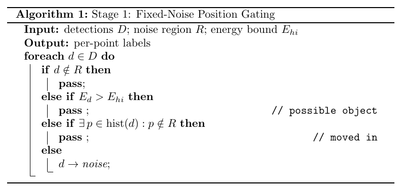
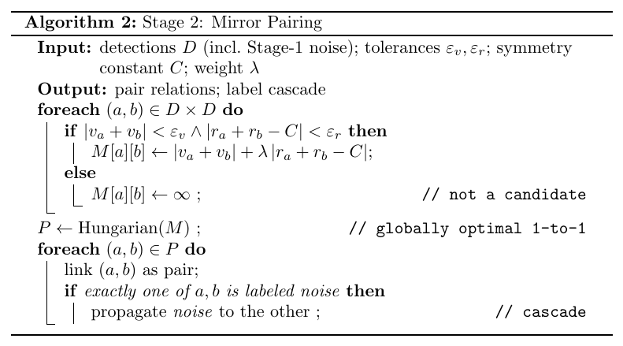
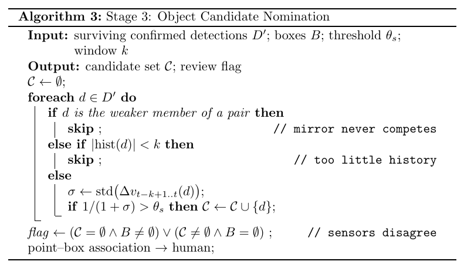

# Semi-Automated Radar Point Labeling — Algorithm Design

This document describes the auto-labeling algorithm used by the MUSE labeling
tool: what we observed in the data, what rules those observations were
formulated into, and the resulting three-stage algorithm. Every rule below is
backed by a measured data characteristic — no threshold or heuristic was
chosen by trial and error.

**Paradigm.** Pseudo-labeling with human-in-the-loop verification. The
algorithm produces preliminary labels; a human reviews every frame in the GUI
before anything is saved. Automation only makes high-confidence decisions —
everything uncertain is left blank for the reviewer.

**Governing rule.** *Mislabeling an object is far worse than passing a
noise.* A passed noise point still faces two more stages and a human
reviewer; a mislabeled object is silently gone from the dataset with no
downstream recovery. Consequently: **when in doubt, pass.** Every stage
below is shaped by this asymmetry.

**Division of labor.**

| Task | Method | Basis |
|---|---|---|
| Fixed-noise gating | rules (Stage 1) | positional invariant |
| Mirror pairing | rules + optimal assignment (Stage 2) | geometric invariant |
| Candidate nomination | rules (Stage 3) | motion invariant (inertia) |
| Point ↔ box association | **human** | under-determined without azimuth — this is precisely what the fusion model is being built to learn; every manual link is a training sample for it |

The algorithm writes only `noise` and `pairs`. The `object` field is written
exclusively by humans.

---

## Stage 1 — Fixed-Noise Position Gating

### What we observed

A persistent detection appears in essentially every frame at the same
location (range ≈ 55.5 m, velocity ≈ +12 km/h in the current dataset):

1. **It never moves.** Its centroid stays inside a small region for the
   entire recording.
2. **Its energy is ordinary.** Measured at ≈ 103 dB — the same magnitude as
   a real car, so energy alone cannot discriminate it.
3. **It is always tracked.** Because it appears every frame, the tracker
   confirms it (`is_confirmed = true`), so track confirmation cannot filter
   it either. Only its position can.

### Rule formulation

The governing rule forbids a "recognition" approach — any rule that tries to
describe what noise *looks like* will occasionally match a real object and
kill it. So the logic is flipped into **exclusion**: a point is only labeled
noise when *no evidence clears it*. The noise betrays itself through two
signatures — it never leaves its region, and its energy stays within a known
band. Anything that violates either signature cannot be the fixed noise:

- outside the region → pass (not Stage 1's business)
- energy above the noise band → pass (possible real object)
- track history has a footprint outside the region → pass (it *moved in*;
  the fixed noise never leaves)

Noise is the **last else**, never the first guess.

### Algorithm

### Known limitations

- An object that re-appears *inside* the region after a detection gap (new
  track id, no outside footprint) with low energy would be mislabeled. This
  requires a triple coincidence and is caught by human review.
- The energy check has no discriminative power in the 100–120 dB band (we
  measured noise at ≈ 103 dB, same as real objects); inside the region, the
  trajectory-footprint check is the only line of defense for real objects.

---

## Stage 2 — Mirror Pairing

### What we observed

Every sufficiently strong return produces an FFT mirror ("ghost"). Across
several hundred frames:

1. **Velocities are opposite:** $v_{ghost} \approx -v_{real}$.
2. **Ranges converge:** the closer the real target, the *larger* the range
   gap to its ghost; as the target recedes, the ghost moves *closer*. The
   two approach each other, the ghost vanishes just before they would cross,
   and it never re-appears afterwards.
3. Observations 1–2 collapse into a single geometric model: the mirror is a
   **point reflection about the RD-map center**,
   $$r_{real} + r_{ghost} \approx C$$
   with $C$ close to the full range-axis length (≈ 69.3 m theoretical).
   The apparent range "drift" is not an error — it is the point symmetry
   itself.
4. **Energy does not decide ownership.** For object pairs the real target is
   consistently ≈ 7 dB stronger; for noise pairs the gap is < 1 dB and
   occasionally inverts. "Which one is the original" is undecidable for
   noise pairs — and, crucially, unnecessary: downstream consumers only need
   the *relation*, never the master/mirror role.

### Rule formulation

- Candidate pairs must satisfy both symmetry conditions:
  $|v_a + v_b| < \varepsilon_v$ and $|r_a + r_b - C| < \varepsilon_r$.
- Conflicts (one point matching several candidates) form an **assignment
  problem** — solved globally (maximize valid pairs, then minimize total
  asymmetry cost), the same machinery the tracker uses for frame-to-frame
  association. Greedy matching is not used: a locally best pick can force
  chain mis-pairings.
- **Link, don't judge.** No master/mirror decision is made. If exactly one
  member of a pair already carries a noise label (usually from Stage 1), the
  label propagates to the other (*cascade*) — Stage 1 labels one member,
  Stage 2 labels the second for free.

### Algorithm

*Implementation note: with ≤ ~15 points per frame the assignment is solved
by exact enumeration (deterministic, identical across JS/Python) rather
than the Hungarian algorithm — same optimum, zero dependencies.*

### Known limitations

- $C$, $\varepsilon_v$, $\varepsilon_r$ are calibrated from manually labeled
  pairs; the point-symmetry model is validated on approach scenarios and the
  ghost's absence after the crossing point is expected behavior (too weak
  and/or masked), not a model failure.

---

## Stage 3 — Object Candidate Nomination

### What we observed

1. **Absolute energy is useless as an object test.** The fixed noise
   measures ≈ 103 dB — identical to a real car. Any "objects are strong"
   rule is dead on arrival.
2. **Multi-object scenes broke the single-winner assumption.** The complex
   scenario contains several objects per frame; an argmax-style "pick the
   best point" design no longer fits.
3. **The only invariant that survives every scene is inertia.** A real
   object's radial velocity changes smoothly frame to frame; clutter jumps
   randomly. Smoothness is scene-independent physics.
4. **Cross-modal association is under-determined.** The radar provides no
   azimuth, so a radar point constrains the target to an arc, not a pixel.
   "Which box does this point belong to" cannot be answered by a rule — it
   requires learned priors, which is exactly the fusion model's job.

### Rule formulation

Stage 3 therefore **nominates, and never links**:

- the weaker member of a pair never competes (it is a mirror);
- points with insufficient history are left blank (not enough evidence);
- the survivors are scored purely on smoothness,
  $S = 1/(1+\sigma)$ where $\sigma$ is the std of frame-to-frame velocity
  changes over the last $k$ frames; $S > \theta_s$ → candidate.
- If the two sensors disagree (radar has candidates but the camera has no
  boxes, or vice versa) the frame is flagged for priority review — the
  disagreement itself is the output, not an error.

Candidates are a **display-only suggestion** (highlighted in the GUI, never
persisted). The human makes every point ↔ box link; each link doubles as a
training sample for the fusion model.

### Algorithm

---

## Parameters

All thresholds live in a single file, `src/utils/algoParams.json`, consumed
by both the frontend button and the batch runner. **Parameters are code**:
the repo copy is the only valid copy; private modifications invalidate the
labels produced with them.

| Parameter | Meaning | How it is set |
|---|---|---|
| `stage1.noiseRegion` | fixed-noise gating rectangle in (range, velocity) | manual first; recalibrated as μ ± 2σ over human-verified noise labels (`calibrate_region.py`) |
| `stage1.energyHiDb` | upper bound of the noise energy band | μ + 3σ over the same labels |
| `stage2.epsV`, `epsR` | symmetry tolerances | 95th percentile over manually labeled pairs |
| `stage2.sumC` | point-symmetry constant $C$ | measured: mean of $r_a + r_b$ over labeled pairs (theoretical ≈ 69.3 m) |
| `stage2.lambda` | range-term weight in the pairing cost | < 1: velocity symmetry is the primary signature |
| `stage3.thetaS` | smoothness threshold | separation point of the S-distributions of labeled objects vs. clutter, biased loose (nominate too many rather than miss one) |
| `stage3.smoothWindowK` | smoothness window | 5 frames |

Calibration discipline: `calibrate_region.py` reads **human-verified frames
only** (never batch-produced labels — the statistics must stay anchored to
an external ground truth), recomputes from scratch (idempotent, no
incremental drift), and records provenance in a `_calibration` field.
Expected frequency: 2–3 times over the project, not per-frame.

---

## Execution model

- **Batch (unattended):** runs Stage 1 + 2 only over the whole dataset and
  writes `noise`/`pairs` into the JSON. Stage 3 is deliberately excluded —
  unattended runs only make decisions backed by invariants.
- **GUI button (attended):** runs all three stages on the current frame.
  Decisions go into the labeling state (one undo step); Stage 3 suggestions
  are drawn as dashed gold rings and vanish on frame change.
- **Save is a human act.** Nothing reaches the JSON file without an explicit
  save; "unsaved = unjudged" is the structural guarantee behind the
  human-verification claim.